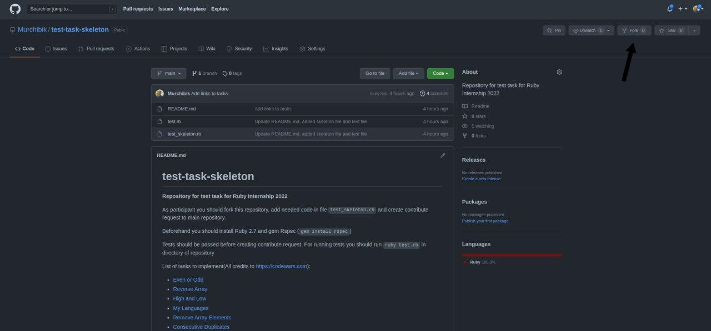
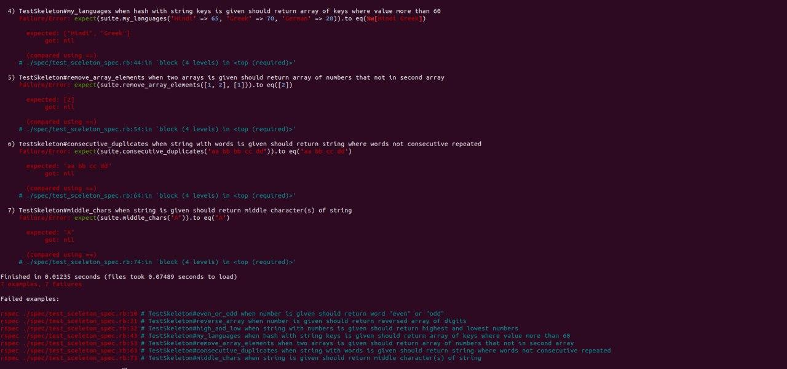
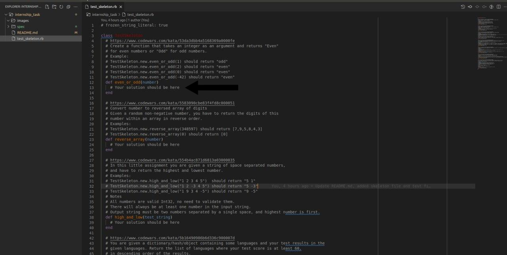
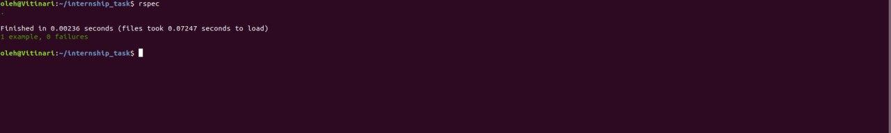
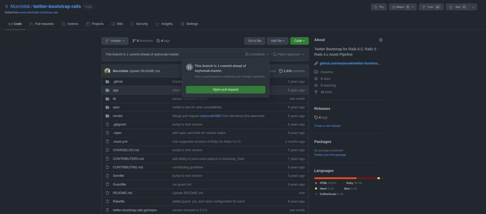

# Test task skeleton
**Repository for test task for Ruby Internship 2022**

As participant you should fork this repository, add needed code in file `test_skeleton.rb` and create contribute request to main repository.

***How to fork repository***

Beforehand you should install Ruby 2.7 and gem Rspec (`gem install rspec`). Tests should be passed before creating contribute request. For running tests you should run `rspec` in directory of repository

***If you will try run `rspec` after cloning repository to local directory you will get this***

***Then you should add correct code here***

***and after that number of failures should decrease, repeat this until you all tests will be passed***

***After that you could create contribute pull request or just send link of repository***

***Then you need to sign up form [here](https://onix.academy/courses/ruby) and wait for response from our HR specialist***

List of tasks to implement(All credits to https://codewars.com):
* [Even or Odd](https://github.com/Murchibik/test-task-skeleton/blob/main/test_skeleton.rb#L12)
* [Reverse Array](https://github.com/Murchibik/test-task-skeleton/blob/main/test_skeleton.rb#L23)
* [High and Low](https://github.com/Murchibik/test-task-skeleton/blob/main/test_skeleton.rb#L38)
* [My Languages](https://github.com/Murchibik/test-task-skeleton/blob/main/test_skeleton.rb#L51)
* [Remove Array Elements](https://github.com/Murchibik/test-task-skeleton/blob/main/test_skeleton.rb#L64)
* [Consecutive Duplicates](https://github.com/Murchibik/test-task-skeleton/blob/main/test_skeleton.rb#L74)
* [Middle Chars](https://github.com/Murchibik/test-task-skeleton/blob/main/test_skeleton.rb#L92)
